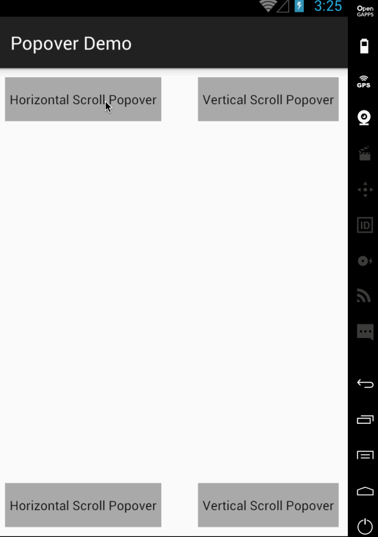

# Popover
Popover component for Android.

# Screenshot



# Setup

* In your `build.gradle` :

```gradle
repositories {
    maven { url "https://jitpack.io" }
}

dependencies {
    implementation 'com.github.nanjingboy:Popover:1.0.3'
}
```

# API

* [PopoverDialog](library/src/main/java/me/tom/popover/PopoverDialog.java)

```java
public void show(View anchor, View contentView, Size popoverSize, Margin popoverMargin);
public void show(View anchor, View contentView, Size popoverSize, ScrollOrientation orientation);
public void show(View anchor, View contentView, Size popoverSize, Margin popoverMargin, ScrollOrientation orientation);
public void dismiss();
public boolean isShowing();
```

### [Example](sample/src/main)

# License

MIT